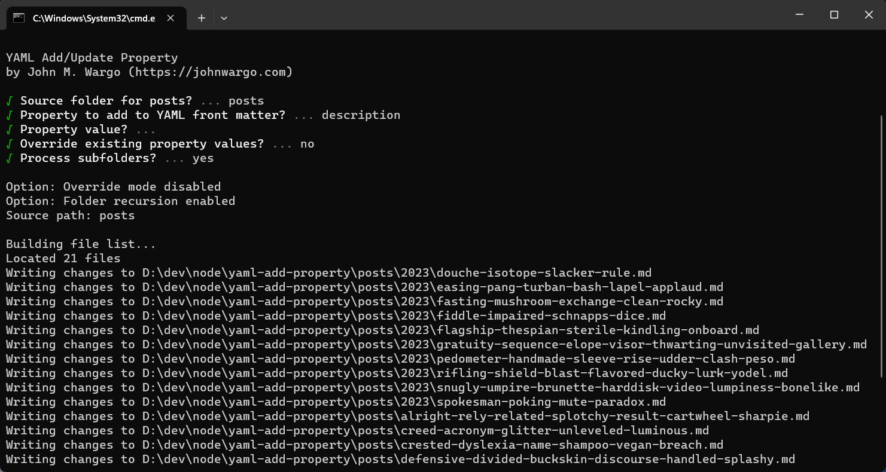

# YAML Add Property

A command-line utility for adding or modifying a YAML front matter property in all files in a particular directory (and all subdirectories therein). Created to enable batch updates of content files with YAML front matter. 

[yaml-add-property](https://www.npmjs.com/package/yaml-add-property) on npm.

I created the module to enable me to add a `description` property (with no value) to all of the Post markdown files in an [Eleventy](https://www.11ty.dev/) site, but it works for any file with YAML front matter. You can easily use it to add a property and value as well.

**Note:** The utility only modifies top-level YAML properties. It does not support nested properties at this time.



## Installation

To install the module globally, open a terminal window or command prompt and execute the following command:

```shell
npm install -g yaml-add-property
```

This adds a `yaml-add-prop` command you can use to batch add a YAML property and, optionally, a property value to all of the files with YAML front matter in a particular folder and all sub-folders.

You can execute the command without installing it first using:

```shell
npx yaml-add-property
```

## Usage

To execute the module, open open a terminal window or command prompt, navigate to a folder near the files you want updated, and execute the following command:

```shell
npx yaml-add-property
```

If you installed the module globally, execute the following command instead:

```shell
yaml-add-prop
```

The module will prompt you for the operational parameters to use while executing:

| Prompt                 | Input  | Description                                                              |
| ---------------------- | ------ | ------------------------------------------------------------------------ | 
| **Source folder**      | String | The folder name, relative to the execution folder, for the source files. |
| **Property name**      | String | The property name added to the YAML front matter.                        |
| **Property value**     | String | The value assigned to the property added to the front matter. When omitted, defaults to a blank string (`''`) |
| **Override existing**  | Yes/No | Controls whether the package overrides the property value if the file already has the property in its front matter. |
| **Process subfolders** | Yes/No | Controls whether the package recurses through sub folders when building the file list |

To display additional information in the console during execution, enable debug mode by adding a `-d` to the command line.

When the command executes, it will update the console: 

```text
YAML Add/Update Property
by John M. Wargo (https://johnwargo.com)

√ Source folder for posts? ... posts
√ Property to add to YAML front matter? ... description
√ Property value? ...
√ Override existing property values? ... no
√ Process subfolders? ... yes

Option: Override mode disabled
Option: Folder recursion enabled
Source path: posts

Building file list...
Located 11 files
Writing changes to D:\my-project\posts\2023\duke-isotope-slacker-rule.md
Writing changes to D:\my-project\posts\2023\easing-pang-turban-bash-lapel-applaud.md
Writing changes to D:\my-project\posts\2023\fasting-mushroom-exchange-clean-rocky.md
Writing changes to D:\my-project\posts\2023\fiddle-impaired-schnapps-dice.md
Writing changes to D:\my-project\posts\alright-rely-related-splotchy-result-cartwheel-sharpie.md
Writing changes to D:\my-project\posts\creed-acronym-glitter-unleveled-luminous.md
Writing changes to D:\my-project\posts\reliant-matchless-groove-salutary.md
Writing changes to D:\my-project\posts\resample-hassle-cycle-stress-stingy-anthill-nature.md
Skipping D:\my-project\posts\temp.jsi, No YAML front matter found.
Writing changes to D:\my-project\posts\that-driving-mankind-kabob.md
Writing changes to D:\my-project\posts\theorize-catfight-untidy-overcook-passenger-demise.md
```

**Note:** Weirdly named post files generated using [Eleventy Generate Posts](https://www.npmjs.com/package/eleventy-generate-posts).

### Getting Help Or Making Changes

Use [GitHub Issues](https://github.com/johnwargo/yaml-add-property/issues) to get help with this module.

Pull Requests gladly accepted, but only with complete documentation of what the change is, why you made it, and why you think its important to have in the module.

*** 

If this code helps you: <a href="https://www.buymeacoffee.com/johnwargo" target="_blank"></a>
